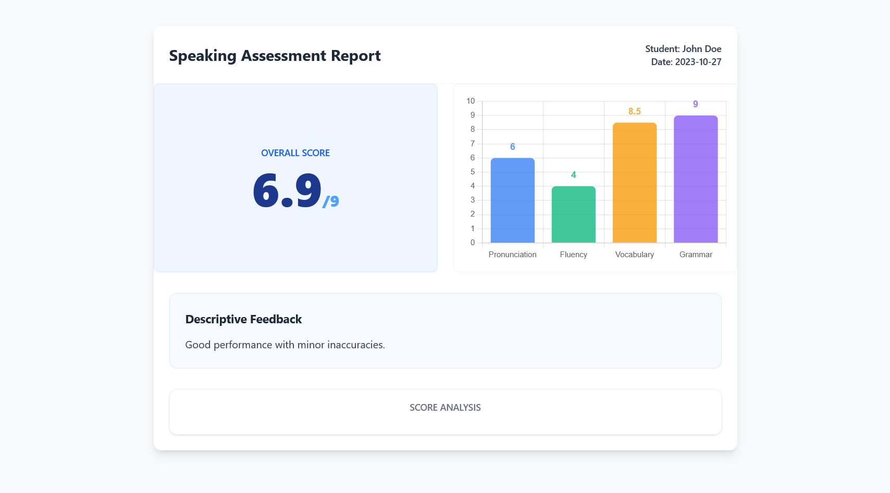

# Student Speaking Assessment Report Dashboard



A professional React-based dashboard designed to visualize student speaking performance. This project satisfies the requirements for a Speaking Assessment Report by displaying overall and skill-specific scores with automated descriptive feedback.

## 🚀 How to Run the Project

1. **Clone the repository:**

   ```
    git clone https://github.com/Tech-Naruto/Speaking-Assessment-Report
    cd Speaking-Assessment-Report

   ```

2. **Install Dependencies:**

   ```
   npm install

   ```

3. **Start the Development Server:**

   ```
   npm run dev

   ```

## 📊 Core Features

- **Dynamic Data Handling:** The application utilizes a JSON structure (public/data.json) to manage student scores and details.
- **Animated Bar Chart:** Individual skill scores (Pronunciation, Fluency, Vocabulary, and Grammar) are visualized using a multi-colored Bar Chart with synchronized data labels for high clarity.
- **Automated Feedback Logic:** The "Descriptive Feedback" section updates automatically based on the student's Overall Score calculation.
- **Responsive UI:** Built with Tailwind CSS to ensure a clean, professional look across different screen sizes.

## 🧠 Feedback Logic

The dashboard implements the following automated feedback mapping based on the overall score:

- **Score >= 8.0:** "Excellent performance with strong control."
- **Score 6.0 - 7.9:** "Good performance with minor inaccuracies."
- **Score < 6.0:** "Needs improvement."

## 🛠️ Tech Stack

- **Framework:** React.js (Vite)
- **Styling:** Tailwind CSS
- **Visualization:** Chart.js & react-chartjs-2
- **Plugins:** chartjs-plugin-datalabels (used for displaying scores directly on the bars)
